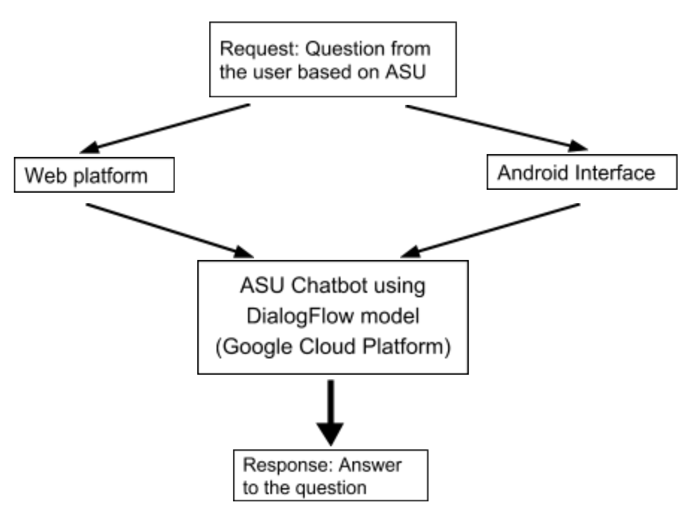

# ASU Chatbot

## Problem Statement

The application ASU chatbot addresses the commonly asked questions of ASU students and generates an automated response answering the query. As known, ASU queries are answered in different web pages. Therefore, the insight of this project is to make the queries of ASU students answered in an easy and convenient manner. ASU chatbot makes search of answers faster in the form of messages or chat. An integration of voice and speech in the web app and android app increases convenience of the user. 

## Design and Implementation

### Architecture

The architecture of the ASU Chatbot system consists of the important Natural Language component which is the Dialogflow model, a Web platform, an Android platform, as well as a Speech platform for users to input their questions. The input questions are the frequently asked questions about ASU. The response is obtained from the Dialogflow model.

* Request from the User:
The request from the user is a question about ASU. It can be taken as an input using any of  the following three ways:

* Web platform: The input here is taken from a web interface in the form of plain text. The input is passed to a REST API designed using Spring Boot which in turn makes a call to the Dialogflow API. This API is used to retrieve responses from the Dialogflow model given the input query in the form of plain text. Certain headers such as Authorization and content-type, as well as various parameters such as input question, session-id and the language are used while making a call to the Dialogflow endpoint. 

* Android interface: Here the user inputs his query on ASU using our ASU Chatbot application present on an Android device. This question is passed on to the Dialogflow API to retrieve the response mapped to the question. The response is then parsed in a way that is displayed back on the Android interface.

* Speech: For speech input, we take the voice input of the user question and parse it into text. This parsed text is sent to the Dialogflow model for the response. Once the response is received, we use TTS to provide a voice enabled answering chat bot.

* Dialogflow model: Dialogflow gives users different ways to interact with products through text based conversational interfaces.It can also be integrated with Google Assistant ,Alexa and Facebook Messenger. The process a Dialogflow model follows from invocation to fulfillment is similar to someone answering a question. We compare the human-human interaction with a conversation with an Dialogflow agent. Here the Dialogflow agent is our ASU Chatbot. An intent in a model represents a mapping between what a user asks and what action should be taken to reciprocate the ask. Intent interfaces have sections like Training Phrases, Action, Response, and Contexts. 

* Response: The response from the Dialogflow model is a JSON object containing all the details about the Dialogflow intent corresponding to the input question. This response is then parsed and the answer to the question is taken out from the parsed content.

### AutoScaling

Google cloud platform offers load balancing and scalability support that enables the incoming traffic to be distributed across multiple instances. Google Compute Engine also offers autoscaling to automatically capabilities to add or remove virtual machines based on increases or decreases in load. Using this feature allows our ASU Chatbot application to handle increases and decreases in traffic. In order to use the in-built autoscaling feature of GCP, we define certain autoscaling policies and the autoscaler performs autoscaling based on these policies as well as the incoming load.

## Testing and evaluation

Testing and evaluation is measured based on 2 parameters:
1. Correctness of result: 
We have tested by asking ASU related queries in different kinds of formats, i.e. questions framed in different ways, broken sentences and questions asked in two or more different messages. The answer returned to the user remains the same. 

2.   Scalability:
To check auto scaling feature of google app engine we modified the test script provided to us in project 1.The script takes input as the url, number of concurrent requests and number of total requests. Once we start the test script, we can see instance usage graph and traffic in google app engine dashboard and see that with increase in user requests, accordingly instances are spawned.

## Code 

* Web Scraping :This is implemented in Beautifulsoup a Python package for parsing HTML documents. ASU FAQ pages were scraped and fed to the Dialogflow  model .

* Web User Interface: This is implemented using javascript and html. Below is the html code to create a chatbox where users can input their queries.
           
* Backend:
The backend takes a request from the frontend as a question and sends it to dialog flow and gets a response. Then the result is displayed in the UI. 

* Android: 
In android, the web request happens through asynctask.
